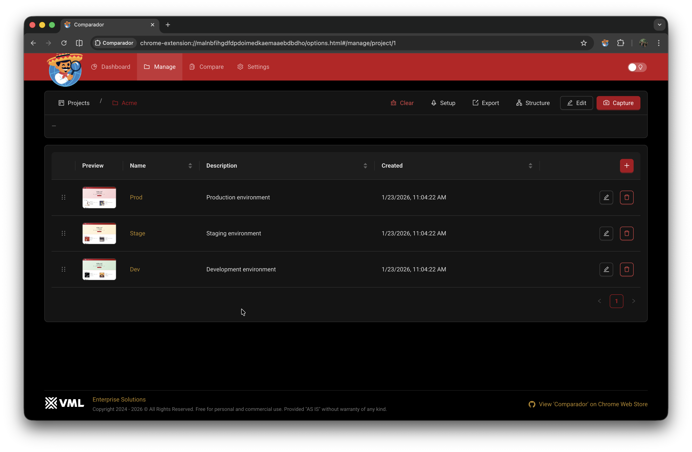
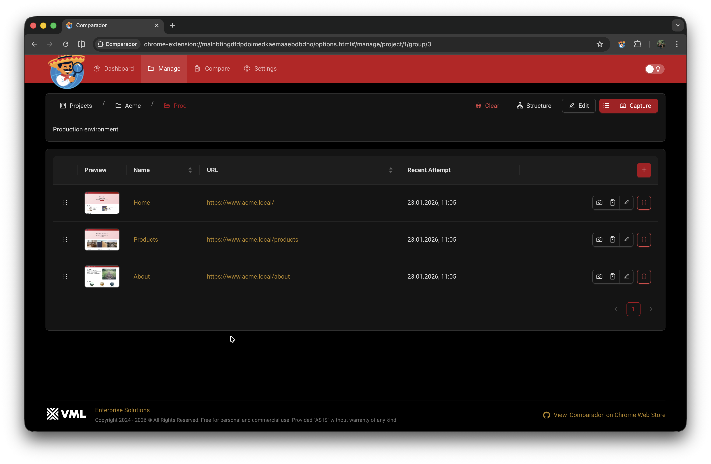
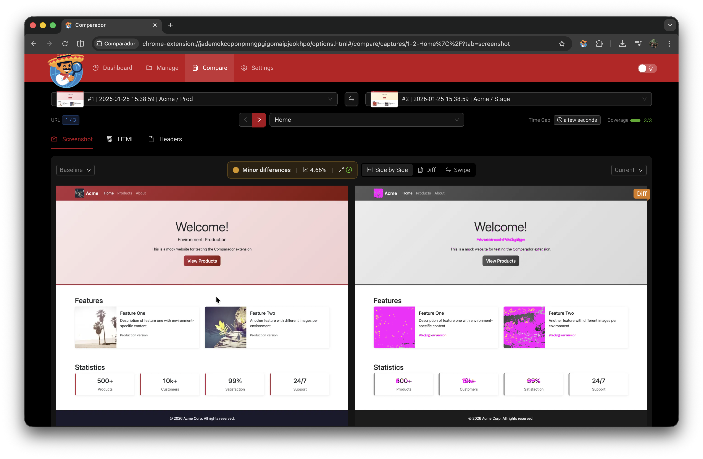

<p align="center">
  
</p>

<p align="center">
  <strong>Fast visual regression testing without the infrastructure</strong><br>
  Chrome Extension · Freeware · Serverless · Privacy-first
</p>

---

## What is Comparador?

Comparador is a Chrome Extension for **on-demand visual regression testing** — compare web pages across environments, track changes over time, debug deployment issues.

**Install → Capture → Compare.**  
No pipelines. No accounts. No external servers.

### Why Comparador?

| Traditional VRT Tools     | Comparador               |
| ------------------------- | ------------------------ |
| Require CI/CD integration | Works standalone         |
| Need baseline management  | Compare any two captures |
| SaaS with accounts        | Runs entirely in browser |
| Complex setup             | Install and go           |

**Use cases:**
- Did deployment break anything?
- Is staging identical to production?
- What exactly changed — layout, HTML, headers?
- Track visual changes over time

---

## Key Features

| Feature             | Description                                                                        |
| ------------------- | ---------------------------------------------------------------------------------- |
| 📸 **Visual Diff**   | Full-page screenshots with pixel-level comparison, mismatch %, multiple view modes |
| 📄 **HTML Diff**     | Side-by-side source comparison with syntax highlighting                            |
| 📋 **Headers Diff**  | Compare response headers (cache, CDN, security)                                    |
| 🚀 **Batch Capture** | Capture projects or groups of URLs, compare across environments                    |
| ⚡ **Popup**         | Quick environment switching + fast access to frequently tested pages               |

### 🔧 Scriptable & Extensible

GUI provides sensible defaults. Power users can script everything:

| Script                | Purpose                                                |
| --------------------- | ------------------------------------------------------ |
| **Browser Script**    | Auth headers, cookies, blocked URLs, user-agent        |
| **Page Script**       | Hide cookie banners, wait for animations               |
| **Navigation Script** | Custom environment switcher in popup                   |
| **Setup Script**      | Auto-generate URLs (envs × paths matrix, sitemap, API) |

---

## Screenshots

|                                                           |                                                                  |
| --------------------------------------------------------- | ---------------------------------------------------------------- |
|  |               |
|            |                |
|         |  |
|        |           |

---

## Installation

### Chrome Web Store (Recommended)

Install directly from the [Chrome Web Store](https://chrome.google.com/webstore/detail/comparador).

### From Release (Manual)

1. Download `comparador-*.zip` from [Releases](../../releases)
2. Extract the ZIP file
3. Open `chrome://extensions/`
4. Enable **Developer mode** (toggle in top-right)
5. Click **Load unpacked** and select the extracted folder

---

## Permissions

| Permission         | Purpose                                                                |
| ------------------ | ---------------------------------------------------------------------- |
| `activeTab`        | Access current tab to capture URL and content                          |
| `tabs`             | Create/manage tabs for batch capture                                   |
| `debugger`         | Chrome DevTools Protocol for full-page screenshots and HTML extraction |
| `webRequest`       | Intercept response headers for comparison                              |
| `host_permissions` | Capture pages from any website                                         |

**Privacy:** All data stored locally. Nothing sent to external servers. See [PRIVACY_POLICY.md](PRIVACY_POLICY.md).

---

## Mock Server

Local HTTPS mock server for testing Comparador.

```bash
cd mock
npm install
npm run setup   # One-time: generate certs, add hosts, trust CA (requires sudo)
npm start
```

**Environments:** `dev.acme.local`, `stage.acme.local`, `www.acme.local`

**Using with Comparador:**
1. Create a new project (e.g., "Acme")
2. Uncomment the environments and paths in project variables
3. Run Setup Script to generate URLs
4. Capture and compare

New projects come pre-configured for mock server — serves as a reference for real-world setup.

---

## Authors

- **Krystian Panek** — Founder & Maintainer — [krystian.panek@vml.com](mailto:krystian.panek@vml.com)
- **Tomasz Sobczyk** — Consultancy — [tomasz.sobczyk@vml.com](mailto:tomasz.sobczyk@vml.com)

---

## License

- **Extension:** [Freeware](assets/EXTENSION-LICENSE)
- **This repo:** [MIT](LICENSE)
