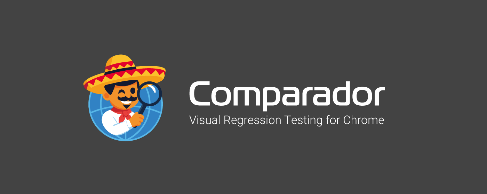
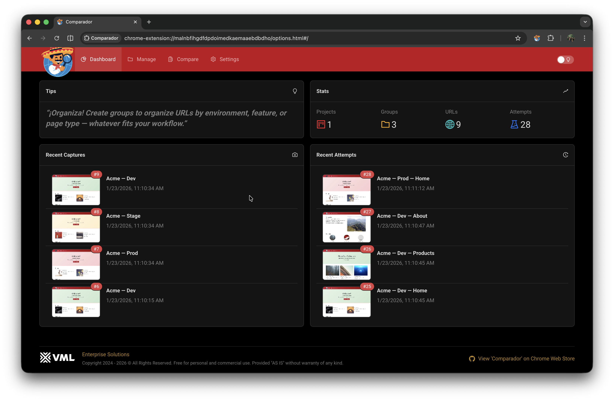
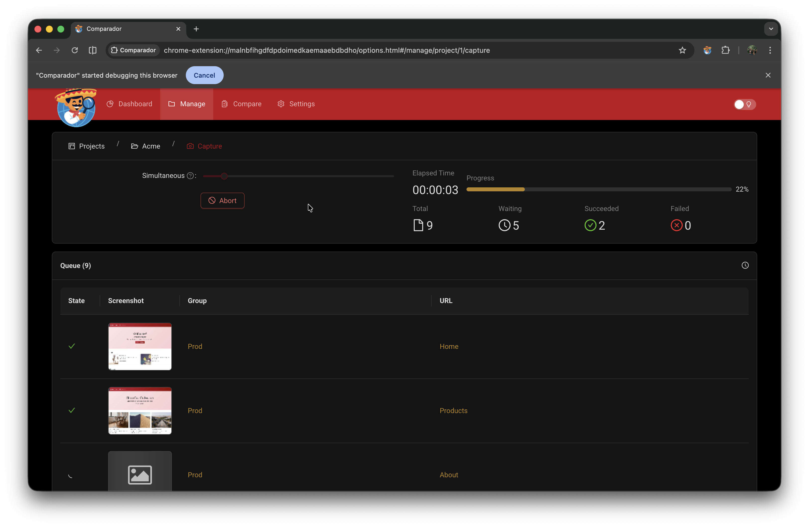
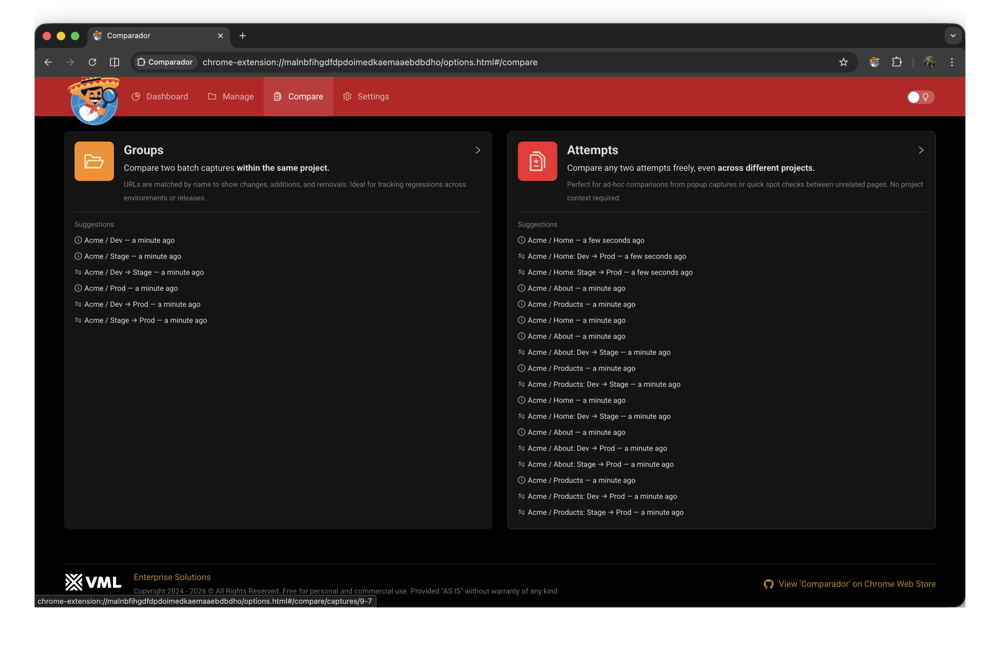
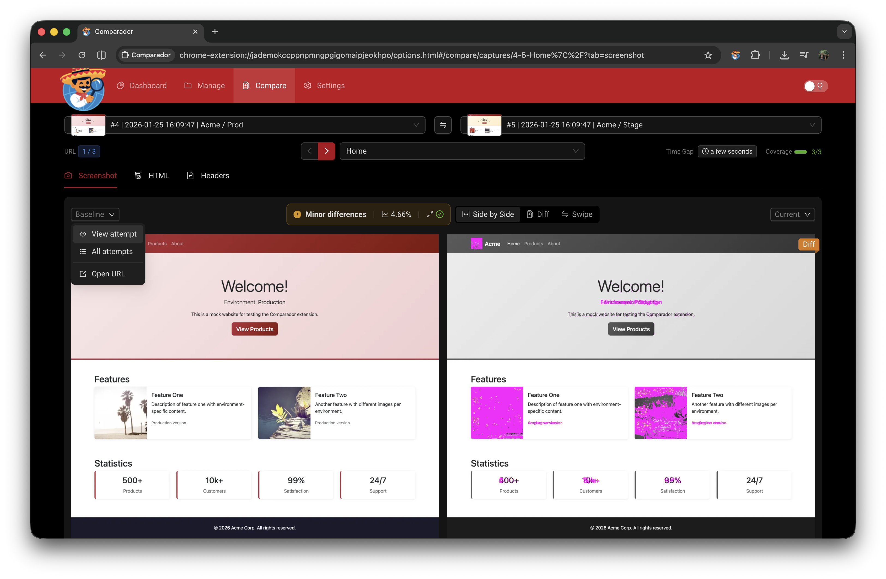
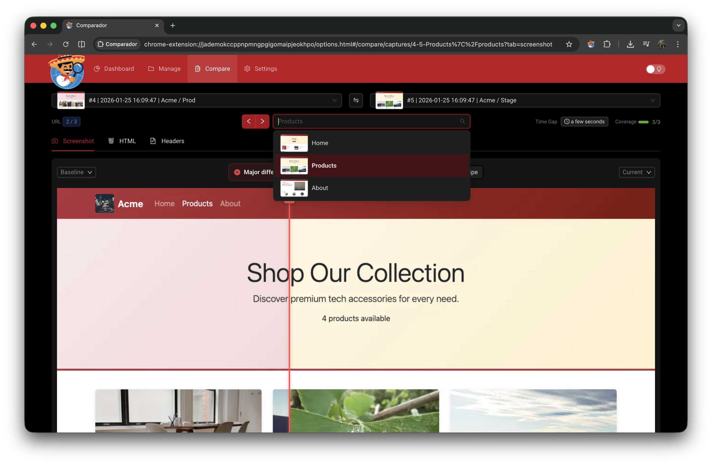
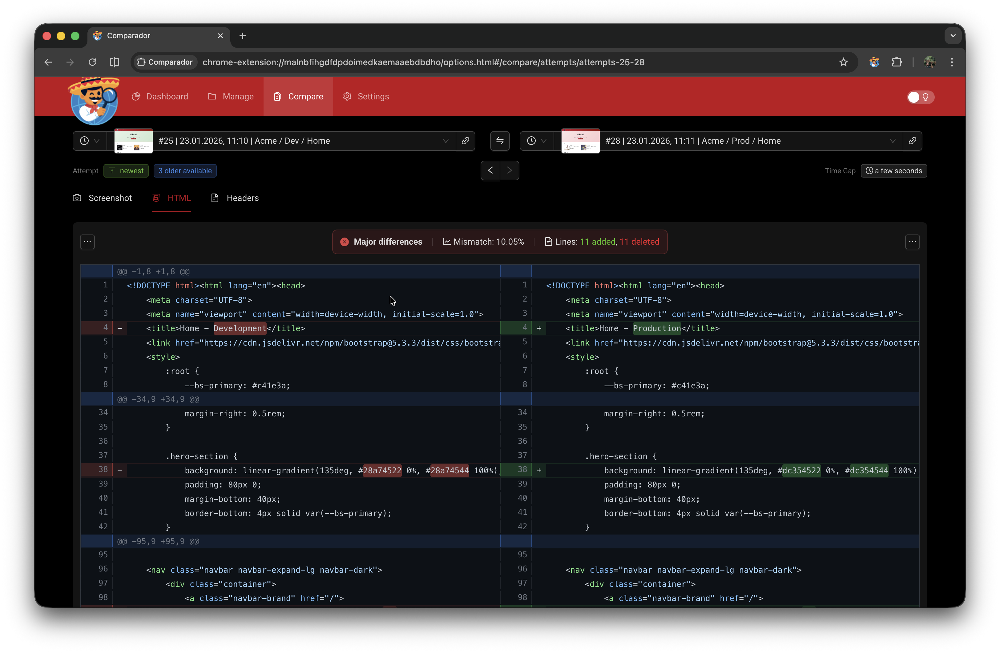
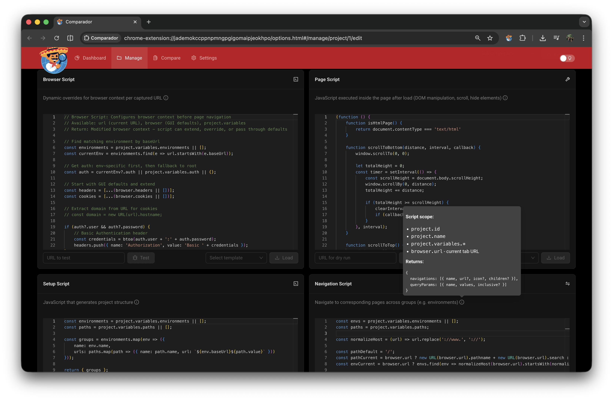
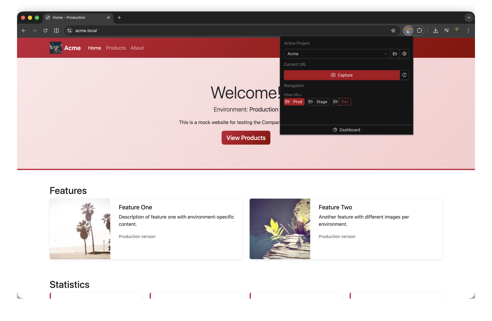
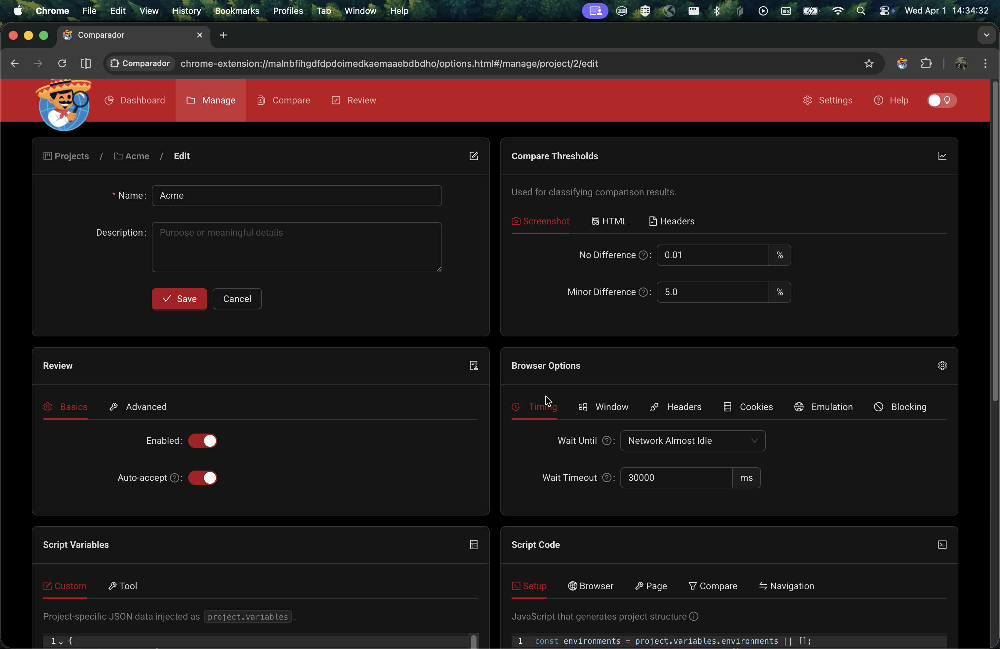

<p align="center">
  
</p>

<p align="center">
  <strong>Instant visual regression testing</strong><br>
  Chrome Extension · Freeware · Serverless · Privacy-first
</p>

<p align="center">
  <a href="https://chromewebstore.google.com/detail/ocfpngpgnhjcpnolhjkpfanhgoalbbhd"></a>
</p>

---

## What is Comparador?

Comparador is a Chrome Extension for **on-demand visual regression testing** — compare web pages across environments, track changes over time, debug deployment issues.

**Install → Capture → Compare.**  
No pipelines. No accounts. No external servers.

### Why Comparador?

| Traditional VRT Tools       | Comparador                 |
| --------------------------- | -------------------------- |
| 🔧 Require CI/CD integration | ✅ Works standalone         |
| 📁 Need baseline management  | ✅ Compare any two captures |
| ☁️ SaaS with accounts        | ✅ Runs entirely in browser |
| ⏳ Complex setup             | ✅ Install and go           |

**Use cases:**
- Did deployment break anything?
- Is staging identical to production?
- What exactly changed — layout, HTML, headers?
- Track visual changes over time

---

## Key Features

| Feature             | Description                                                                        |
| ------------------- | ---------------------------------------------------------------------------------- |
| 📸 **Visual Diff**   | Full-page screenshots with pixel-level comparison, mismatch %, multiple view modes |
| 📄 **HTML Diff**     | Side-by-side source comparison with syntax highlighting                            |
| 📋 **Headers Diff**  | Compare response headers (cache, CDN, security)                                    |
| 🚀 **Batch Capture** | Capture projects or groups of URLs, compare across environments                    |
| ⚡ **Popup**         | Quick environment switching + fast access to frequently tested pages               |

### 🔧 Scriptable & Extensible

GUI provides sensible defaults. Power users can script everything:

| Script                | Purpose                                                |
| --------------------- | ------------------------------------------------------ |
| **Browser Script**    | Auth headers, cookies, blocked URLs, user-agent        |
| **Page Script**       | Hide cookie banners, wait for animations               |
| **Navigation Script** | Custom environment switcher in popup                   |
| **Setup Script**      | Auto-generate URLs (envs × paths matrix, sitemap, API) |

---

## Comparador vs Alternatives

| Feature                      | Comparador         | Percy / Chromatic  | BackstopJS         | Playwright VRT     |
| ---------------------------- | ------------------ | ------------------ | ------------------ | ------------------ |
| **Setup time**               | 🟢 Minutes          | 🟡 Hours            | 🟡 Hours            | 🔴 Days             |
| **Infrastructure required**  | 🟢 Chrome only      | 🔴 SaaS             | 🟡 Node.js          | 🟡 CI/CD            |
| **Account required**         | 🟢 No               | 🔴 Yes              | 🟢 No               | 🟢 No               |
| **Works offline**            | 🟢 Yes              | 🔴 No               | 🟢 Yes              | 🟢 Yes              |
| **Ad-hoc comparisons**       | 🟢 Any two captures | 🔴 Baseline only    | 🔴 Baseline only    | 🔴 Baseline only    |
| **Beyond screenshots**       | 🟢 HTML + headers   | 🔴 Screenshots only | 🔴 Screenshots only | 🔴 Screenshots only |
| **Auth / cookies scripting** | 🟢 Yes              | 🟡 Config           | 🟡 Config           | 🟢 Yes              |
| **CI/CD integration**        | 🔴 No               | 🟢 Yes              | 🟢 Yes              | 🟢 Yes              |
| **Baseline management**      | 🟡 Manual           | 🟢 Automatic        | 🟢 Automatic        | 🟢 Automatic        |
| **Team collaboration**       | 🔴 Local only       | 🟢 Cloud dashboard  | 🟡 Git              | 🟡 Git              |

### When to use Comparador

✅ **Best for:**
- QA engineers doing manual exploratory testing
- Developers debugging production issues
- Quick "before/after" deployment checks
- Comparing staging vs production
- Teams without CI/CD pipeline access
- Privacy-sensitive projects (data stays local)

❌ **Not ideal for:**
- Fully automated CI/CD visual regression
- Large teams needing shared baselines
- Hundreds of pages requiring scheduled runs

### Complementary usage

Comparador works alongside CI/CD tools. Use it for:
- Ad-hoc debugging when CI catches a diff
- Testing environments not in your pipeline
- Quick checks before committing
- Investigating customer-reported visual issues

---

## Screenshots

|                       Organize URLs                       |                   Capture Pages                    |
| :-------------------------------------------------------: | :------------------------------------------------: |
|  |  |
|                  Projects, groups, URLs                   |            Batch capture with progress             |

|                  Compare Captures                  |                      Compare: Side by Side                      |
| :------------------------------------------------: | :-------------------------------------------------------------: |
|  |  |
|           Select two captures to compare           |                 Differences highlighted in pink                 |

|                   Compare: Swipe View                    |                      HTML Diff                      |
| :------------------------------------------------------: | :-------------------------------------------------: |
|  |  |
|           Drag the red line to reveal changes            |           Side-by-side source comparison            |

|                        Scripts                         |                        Popup                        |
| :----------------------------------------------------: | :-------------------------------------------------: |
|  |  |
|            Browser, page, setup, navigation            |         Quick capture & environment switch          |

|                        Settings                         |
| :-----------------------------------------------------: |
|  |
|                Per-project configuration                |

---

## Installation

### Chrome Web Store (Recommended)

Install directly from the [Chrome Web Store](https://chrome.google.com/webstore/detail/comparador).

### From Release (Manual)

1. Download `comparador-*.zip` from [Releases](../../releases)
2. Extract the ZIP file
3. Open `chrome://extensions/`
4. Enable **Developer mode** (toggle in top-right)
5. Click **Load unpacked** and select the extracted folder

---

## Permissions

| Permission         | Purpose                                                                |
| ------------------ | ---------------------------------------------------------------------- |
| `activeTab`        | Access current tab to capture URL and content                          |
| `tabs`             | Create/manage tabs for batch capture                                   |
| `debugger`         | Chrome DevTools Protocol for full-page screenshots and HTML extraction |
| `webRequest`       | Intercept response headers for comparison                              |
| `host_permissions` | Capture pages from any website                                         |

**Privacy:** All data stored locally. Nothing sent to external servers. See [PRIVACY_POLICY.md](PRIVACY_POLICY.md).

---

## Mock Server

Local HTTPS mock server for testing Comparador.

```bash
cd mock
npm install
npm run setup   # One-time: generate certs, add hosts, trust CA (requires sudo)
npm start
```

**Environments:** `dev.acme.local`, `stage.acme.local`, `www.acme.local`

**Using with Comparador:**
1. Create a new project (e.g., "Acme")
2. Uncomment environments and paths in **Variables**
3. Go to **Manage** → select project → **Setup** → **Generate Preview** → **Apply Changes**
4. Capture pages and compare across environments

New projects come pre-configured for mock server — serves as a reference for real-world setup.

---

## Authors

- **Krystian Panek** — Founder & Maintainer — [krystian.panek@vml.com](mailto:krystian.panek@vml.com)
- **Tomasz Sobczyk** — Consultancy — [tomasz.sobczyk@vml.com](mailto:tomasz.sobczyk@vml.com)

---

## License

- **Extension:** [Freeware](assets/EXTENSION-LICENSE)
- **This repo:** [MIT](LICENSE)
